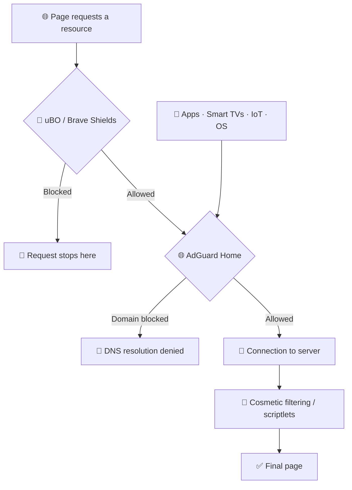
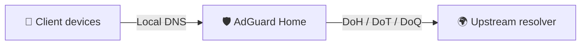
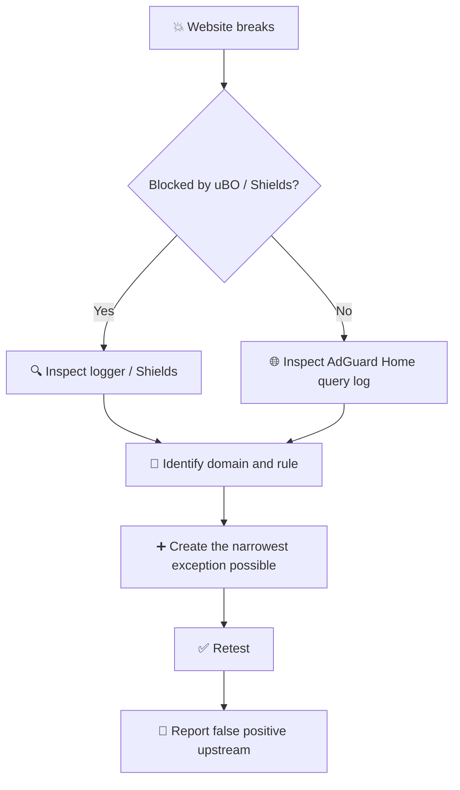

# 🛡️ Ad, Tracker & Threat Blocking Guide

## 📑 Table of Contents

* [1. Recommended architecture](#1--recommended-architecture)
* [2. Quick configuration](#2--quick-configuration)
* [3. uBlock Origin](#3--ublock-origin)
* [4. Brave Shields](#4--brave-shields)
* [5. AdGuard Home](#5--adguard-home)
* [6. Preventing AdGuard Home bypass](#6--preventing-adguard-home-bypass)
* [7. Troubleshooting and false positives](#7--troubleshooting-and-false-positives)
* [8. Verification](#8--verification)
* [9. Maintenance](#9--maintenance)

---

# 1. 🧱 Recommended Architecture

DNS filtering and browser-level filtering are **complementary layers, not alternatives**.

Each layer sees different information and therefore solves different problems.

## 🌐 AdGuard Home

AdGuard Home operates primarily at the **DNS/domain level**.

It is particularly useful for:

* applications without their own content blocker;
* smartphones and tablets;
* Smart TVs;
* game consoles;
* IoT devices;
* operating-system and application telemetry;
* advertising and tracking domains;
* known malicious, phishing, and scam domains.

However, DNS filtering cannot inspect the full URL or modify the page itself.

It cannot reliably distinguish between:

```text
example.com/ads/banner.js
```

and:

```text
example.com/article
```

because both requests ultimately resolve the same hostname:

```text
example.com
```

---

## 🧩 uBlock Origin and Brave Shields

Browser-level blockers have much more context.

They can evaluate:

* the full URL;
* the page that initiated the request;
* first-party vs. third-party requests;
* resource type;
* scripts;
* images;
* iframes;
* XHR/fetch requests;
* page elements.

They can also perform tasks that DNS filtering cannot, such as:

* cosmetic filtering;
* scriptlet injection;
* URL parameter removal;
* per-site exceptions;
* contextual network filtering.

---

## 🔄 Simplified request flow



> [!TIP]
> The browser performs the **fine-grained filtering**.
>
> AdGuard Home provides **broad network coverage** for traffic that never passes through a browser extension or built-in browser blocker.

This redundancy is useful.

Blindly duplicating millions of domain rules across every layer usually is not.

---

# 2. ⚡ Quick Configuration

This guide has **one recommended default profile** and **one performance fallback**.

The rule is simple:

> **Start with and keep PRO++ Full + TIF Full.**
>
> Only switch to the performance fallback if the device or server shows real performance problems such as excessive memory use, very slow filter reloads, browser instability, or clearly degraded responsiveness.

## ✅ Default profile — use this first

| Tool              | Configuration                                                                  |
| ----------------- | ------------------------------------------------------------------------------ |
| **uBlock Origin** | Default lists + regional lists + URL Tracking Protection + PRO++ Full + TIF Full |
| **Brave Shields** | Aggressive mode + regional lists + URL Tracking Protection + PRO++ Full + TIF Full |
| **AdGuard Home**  | HaGeZi Multi PRO++ Full + TIF Full + Dandelion Sprout Anti-Malware           |

The default HaGeZi profile is:

* **HaGeZi Multi PRO++ — Full**
* **HaGeZi Threat Intelligence Feeds — TIF Full**

This is the profile users should normally run in both the browser and DNS layers.

## 🪶 Performance fallback — only when necessary

If the full profile causes measurable performance problems, replace it with this **single reduced profile**:

* **HaGeZi Multi PRO++ — Mini**
* **HaGeZi Threat Intelligence Feeds — TIF Medium**

Do not reduce the lists pre-emptively. Do not choose intermediate combinations. In this guide, the reduced profile exists only as a fallback for hardware or browser resource limitations.

### External list policy

All manually imported external lists in this guide use **jsDelivr** URLs.

> [!WARNING]
> **PRO++ Full and TIF Full are intentionally heavy and aggressive.**
>
> Higher memory usage and longer list reloads are expected compared with the fallback profile. That alone is not a reason to downgrade unless it creates an actual usability or stability problem.

---

# 3. 🧩 uBlock Origin

## 3.1. Keep the Default Configuration

Open:

<kbd>uBO</kbd> → <kbd>Dashboard</kbd> → <kbd>Filter lists</kbd>

uBlock Origin already ships with an excellent baseline.

Do not rebuild it from scratch unless you have a specific reason to do so.

### Important built-in lists

* ✅ **uBlock filters – Ads**
* ✅ **uBlock filters – Badware risks**
* ✅ **uBlock filters – Privacy**
* ✅ **uBlock filters – Quick fixes**
* ✅ **uBlock filters – Unbreak**

> [!CAUTION]
> **Do not disable `Quick fixes` or `Unbreak`.**
>
> Aggressive blocking also requires rules designed to **repair website breakage**, not just additional blocking rules.

---

## 3.2. 🌍 Regional Lists

Enable the regional lists that match the languages you actually browse.

For Spanish-language websites, for example:

* ✅ **EasyList Spanish**
* ✅ **AdGuard Spanish/Portuguese**

There is little value in enabling regional lists for languages you rarely or never use.

---

## 3.3. 🔗 URL Tracking Protection

Enable:

> **AdGuard/uBO – URL Tracking Protection**

This category can remove common tracking parameters such as:

```text
utm_source
utm_campaign
fbclid
gclid
msclkid
```

Conceptually:

```diff
- https://example.com/article?utm_source=newsletter&utm_campaign=summer
+ https://example.com/article
```

This addresses a different tracking mechanism from conventional ad or domain blocking, so it is a useful addition.

---

## 3.4. 🍪 Cookie Notices and Other Annoyances

uBO provides optional filters for categories such as:

* cookie notices;
* social widgets;
* newsletter prompts;
* notification requests;
* pop-ups;
* other annoyances.

A sensible approach is:

> **Enable only the categories you actually want removed.**

> [!NOTE]
> Hiding a consent banner does **not necessarily mean that consent has been actively rejected**.
>
> Annoyance filters should primarily be treated as interface-cleanup tools rather than as a substitute for browser privacy controls or explicit consent handling.

More cosmetic filtering can also mean more opportunities for page breakage.

---

## 3.5. 🏠 Local Network Protection

Optional:

> **Block Outsider Intrusion into LAN**

This provides additional protection against websites attempting to interact with resources on private network ranges such as:

```text
192.168.x.x
10.x.x.x
172.16.x.x – 172.31.x.x
```

<details>
<summary><strong>⚠️ When can this cause problems?</strong></summary>

It may interfere with browser-based access to legitimate local services such as:

* Home Assistant;
* Jellyfin;
* NAS dashboards;
* router interfaces;
* printers;
* development servers;
* self-hosted web applications;
* other local administration panels.

If you regularly access local services from the browser, be prepared to create narrow exceptions.

</details>

---

## 3.6. 🧱 External Lists — Default Full Profile

Use the **full** HaGeZi lists in the browser by default:

```text
https://cdn.jsdelivr.net/gh/hagezi/dns-blocklists@latest/adblock/pro.plus.txt
https://cdn.jsdelivr.net/gh/hagezi/dns-blocklists@latest/adblock/tif.txt
```

| List                          | Purpose                                                |
| ----------------------------- | ------------------------------------------------------ |
| **HaGeZi Multi PRO++ — Full** | Ads, tracking, telemetry, affiliate infrastructure, and other unwanted domains |
| **HaGeZi TIF — Full**         | Malware, phishing, scams, and malicious infrastructure |

> [!IMPORTANT]
> **PRO++ Full + TIF Full is the normal browser configuration in this guide.**
>
> Do not choose smaller variants merely to save resources on paper. Keep the full lists unless they cause an observable performance or stability problem on that device.

### 🪶 Performance fallback

Only if the full profile causes real performance problems, replace **both** full HaGeZi lists with this single reduced profile:

```text
https://cdn.jsdelivr.net/gh/hagezi/dns-blocklists@latest/adblock/pro.plus.mini.txt
https://cdn.jsdelivr.net/gh/hagezi/dns-blocklists@latest/adblock/tif.medium.txt
```

| List                           | Role in the fallback profile |
| ------------------------------ | ---------------------------- |
| **HaGeZi Multi PRO++ — Mini**  | Reduced-size PRO++ variant   |
| **HaGeZi TIF — Medium**        | Reduced-size TIF variant     |

> [!WARNING]
> Do not treat this as an alternative preference profile. It is only a resource fallback for systems that cannot run PRO++ Full + TIF Full comfortably.

<details>
<summary><strong>🦠 Dandelion Sprout Anti-Malware — optional additional source</strong></summary>

If you also want Dandelion Sprout Anti-Malware, import it through **jsDelivr**:

```text
https://cdn.jsdelivr.net/gh/DandelionSprout/adfilt@master/Dandelion%20Sprout%27s%20Anti-Malware%20List.txt
```

This is an additional malware- and scam-oriented source. The normal HaGeZi profile remains PRO++ Full + TIF Full; the reduced HaGeZi profile is only for performance problems.

</details>

> [!IMPORTANT]
> All manually imported external list URLs in this guide use **jsDelivr**.

---

## 3.7. 🧨 Dynamic Filtering

uBlock Origin supports much more restrictive configurations, including:

* *medium mode*;
* *hard mode*;
* dynamic filtering;
* per-domain rules;
* stricter script and frame policies.

These modes are powerful, but they should not be part of a general-purpose recommendation.

> [!WARNING]
> Dynamic filtering requires active maintenance and per-site decisions.
>
> If you are not prepared to maintain those rules, a well-designed static configuration is preferable to a poorly maintained advanced mode.

---

# 4. 🦁 Brave Shields

## 4.1. Main Setting

Open:

```text
brave://settings/shields
```

Set:

> **Trackers & ads blocking → Aggressive**

Aggressive mode is the most appropriate setting for a configuration focused on comprehensive content blocking.

---

## 4.2. 📚 Filter Lists

Open:

```text
brave://settings/shields/filters
```

Brave already incorporates its own filtering rules and rules derived from established filter-list projects.

> [!IMPORTANT]
> Do not manually import **EasyList, EasyPrivacy, or uAssets** merely because they are commonly used with uBO if Brave already incorporates them.
>
> Duplicating a source does not create an independent layer of protection.

---

## 4.3. 🌍 Regional Coverage

Enable the regional lists relevant to the languages you browse.

For Spanish-language websites, for example:

* **EasyList Spanish**
* **AdGuard Spanish/Portuguese**

If Brave already exposes the relevant list through its built-in catalog, prefer enabling it there instead of manually importing its URL.

---

## 4.4. 🔗 URL Tracking Protection

If available in your installation, enable:

* ✅ **Tracking URL blocker**

Brave also includes its own mechanisms for stripping selected tracking parameters, so this should be considered complementary rather than the sole source of URL cleanup.

---

## 4.5. 🧹 Annoyance Filters

Optional categories may include:

* 🍪 cookie notices;
* 💬 floating chats;
* 🔔 notification prompts;
* 📧 newsletter prompts;
* 📱 “install our app” banners;
* 👥 social widgets;
* 🪟 pop-ups.

Enable them according to your preferences.

> [!TIP]
> If a page suddenly loses an important dialog, button, or form, annoyance filters should be among the first things you investigate.

---

## 4.6. 🧱 Default PRO++ Full + TIF Full Profile

Import the same **full** browser lists used with uBlock Origin:

```text
https://cdn.jsdelivr.net/gh/hagezi/dns-blocklists@latest/adblock/pro.plus.txt
https://cdn.jsdelivr.net/gh/hagezi/dns-blocklists@latest/adblock/tif.txt
```

### Normal result

```text
Brave Shields
│
├── 🛡️ Trackers & ads: Aggressive
├── 🌍 Regional filters
├── 🔗 URL Tracking Protection
├── 🧹 Annoyance filters [optional]
│
└── 🔥 Default external profile
    ├── HaGeZi Multi PRO++ — Full
    └── HaGeZi TIF — Full
```

Keep this configuration unless Brave shows an actual resource or stability problem attributable to the list size.

### 🪶 Performance fallback

If the full profile causes real performance problems, replace both HaGeZi lists with:

```text
https://cdn.jsdelivr.net/gh/hagezi/dns-blocklists@latest/adblock/pro.plus.mini.txt
https://cdn.jsdelivr.net/gh/hagezi/dns-blocklists@latest/adblock/tif.medium.txt
```

```text
Brave Shields — performance fallback
│
├── HaGeZi Multi PRO++ — Mini
└── HaGeZi TIF — Medium
```

> [!WARNING]
> This is the **only reduced Brave profile** in the guide. Do not use it unless the full profile creates a measurable performance or stability issue.

---

## 4.7. Use One General-Purpose Browser Blocker

If Brave Shields is your general-purpose content blocker, do not add another general-purpose blocker solely in an attempt to “stack” protection.

Doing so complicates:

* exceptions;
* troubleshooting;
* rule attribution;
* breakage diagnosis.

The complementary layer should be your DNS filter, not a second browser blocker competing for the same requests.

---

# 5. 🌐 AdGuard Home

AdGuard Home is where the **heavy domain-based filtering** should normally live.

Open:

<kbd>Filters</kbd> → <kbd>DNS blocklists</kbd>

---

## 5.1. 📙 HaGeZi Multi PRO++ — Full

Use **HaGeZi Multi PRO++** as the main DNS blocklist.

```text
https://cdn.jsdelivr.net/gh/hagezi/dns-blocklists@latest/adblock/pro.plus.txt
```

PRO++ applies a deliberately aggressive policy against categories such as:

* tracking;
* telemetry;
* affiliate infrastructure;
* analytics;
* advertising;
* other unwanted domains.

> [!CAUTION]
> **PRO++ is intentionally aggressive.**
>
> Be prepared to create narrow exceptions for legitimate services that are caught by the list.

---

## 5.2. ☣️ HaGeZi Threat Intelligence Feeds — TIF Full

Use **TIF Full**.

```text
https://cdn.jsdelivr.net/gh/hagezi/dns-blocklists@latest/adblock/tif.txt
```

TIF is primarily security-oriented and targets categories such as:

* malware;
* phishing;
* scams;
* spam;
* command-and-control infrastructure;
* other malicious domains.

> [!WARNING]
> **TIF Full is very large.**
>
> HaGeZi currently marks TIF Full for AdGuard Home systems with at least **2 GB of RAM**. Expect substantial memory use and longer filter reload times.

---

## 5.3. 🦠 Dandelion Sprout Anti-Malware

Use the AdGuard Home-specific version through **jsDelivr**:

```text
https://cdn.jsdelivr.net/gh/DandelionSprout/adfilt@master/Alternate%20versions%20Anti-Malware%20List/AntiMalwareAdGuardHome.txt
```

> [!IMPORTANT]
> Do not accidentally use the uBO-oriented version here.
>
> Each filtering engine should receive a list in a syntax it can interpret correctly.

---

## 5.4. 📦 Recommended AdGuard Home Profile

### ✅ Default profile

Use this profile first and keep it whenever the server handles it comfortably:

```text
AdGuard Home
├── HaGeZi Multi PRO++ — Full
├── HaGeZi TIF — Full
└── Dandelion Sprout Anti-Malware
```

```text
https://cdn.jsdelivr.net/gh/hagezi/dns-blocklists@latest/adblock/pro.plus.txt
https://cdn.jsdelivr.net/gh/hagezi/dns-blocklists@latest/adblock/tif.txt
```

### 🪶 Performance fallback

Only if the full lists create a real memory, reload-time, or stability problem, replace both HaGeZi lists with the single reduced profile below:

```text
AdGuard Home
├── HaGeZi Multi PRO++ — Mini
├── HaGeZi TIF — Medium
└── Dandelion Sprout Anti-Malware
```

```text
https://cdn.jsdelivr.net/gh/hagezi/dns-blocklists@latest/adblock/pro.plus.mini.txt
https://cdn.jsdelivr.net/gh/hagezi/dns-blocklists@latest/adblock/tif.medium.txt
```

> [!IMPORTANT]
> The fallback is not a co-equal recommendation. **PRO++ Full + TIF Full remains the default.** Use the reduced profile only after confirming that the full profile is causing performance problems.

---

## 5.5. 🚫 What Not to Put in AdGuard Home

Avoid indiscriminately importing lists designed primarily for browser content blockers.

A DNS filter cannot meaningfully apply browser-specific rules such as:

```text
||example.com/ads/banner.js
##.advertisement
$script
$removeparam
```

Those rules depend on information that DNS does not have.

A useful rule of thumb is:

> **DNS → domain-oriented filtering.**
> **Browser → URLs, request context, cosmetic filtering, scriptlets, and precise exceptions.**

---

## 5.6. 🔐 Encrypted Upstream DNS

AdGuard Home can use encrypted upstream resolvers via:

* **DoH** — DNS over HTTPS;
* **DoT** — DNS over TLS;
* **DoQ** — DNS over QUIC.

The architecture then looks like this:



This encrypts the DNS traffic between:

```text
AdGuard Home → upstream DNS resolver
```

It does not automatically encrypt ordinary DNS traffic between local clients and AdGuard Home.

For a trusted home LAN, unencrypted local DNS combined with an encrypted upstream is a perfectly reasonable design.

---

## 5.7. 🔏 DNSSEC

Check that DNSSEC validation has not been disabled in your installation.

There is no reason to toggle settings unnecessarily if your current configuration already has validation enabled and working correctly.

---

# 6. 🚧 Preventing AdGuard Home Bypass

A filtered DNS resolver can only protect traffic that actually reaches it.

---

## 6.1. 📡 DHCP

Advertise AdGuard Home as the DNS resolver through DHCP.

> [!WARNING]
> Avoid simultaneously advertising an unfiltered public resolver as a “secondary DNS server”.
>
> Many operating systems do not treat the secondary server purely as an emergency fallback and may query it directly.

---

## 6.2. 🔒 Traditional DNS

If your router or firewall supports it, either:

* block outbound TCP/UDP port `53`; or
* redirect outbound port `53` traffic to AdGuard Home.

This prevents simple bypass attempts such as:

```text
device → 8.8.8.8:53
```

---

## 6.3. 🕵️ Encrypted DNS

DoT is relatively straightforward to identify because it commonly uses port:

```text
853
```

DoH is different.

It normally travels over ordinary HTTPS:

```text
TCP/443
```

Blocking port `443` is obviously not a viable solution because it would also break normal web browsing.

<details>
<summary><strong>🔧 Networks where local DNS must be enforced</strong></summary>

If you deliberately want to prevent clients from using alternative resolvers, you can combine firewall rules with lists of known:

* public DoH resolvers;
* VPN endpoints;
* proxy services;
* DNS bypass services.

Be aware that this is an intentionally restrictive policy.

It can interfere with legitimate use of:

* VPNs;
* Tor;
* proxies;
* Private DNS;
* applications with their own resolvers.

Only implement it if enforcing the local DNS policy is actually one of your goals.

</details>

---

# 7. 🔍 Troubleshooting and False Positives

A strict configuration will eventually break something.

The difference between a maintainable setup and a frustrating one is **how you diagnose and repair those failures**.

> [!IMPORTANT]
> **Never disable an entire filter list to fix a single website unless you have determined that the list itself is unsuitable for your setup.**

---

## 🧭 Troubleshooting Flow



---

## 7.1. uBlock Origin

Open the **Logger** and reproduce the problem.

You want to identify:

```text
request
   ↓
matching rule
   ↓
responsible filter list
```

### Example of a Site-Specific Exception

```text
@@||api.example.com^$domain=www.affected-site.com
```

This allows `api.example.com` only when the request originates from:

```text
www.affected-site.com
```

That is generally preferable to allowing the domain globally.

---

## 7.2. AdGuard Home

Open:

<kbd>Query Log</kbd>

Reproduce the issue and inspect the blocked domain and matching rule.

A DNS exception might look like:

```text
@@||api.example.com^
```

> [!NOTE]
> A DNS exception is inherently broader than a contextual browser exception.
>
> AdGuard Home does not know which webpage caused the DNS lookup.

---

## 7.3. Brave Shields

Temporarily disable Shields **for the affected site only**.

If the page starts working:

1. identify which filtering category is responsible;
2. create or apply the narrowest reasonable exception;
3. restore the rest of Shields.

Avoid globally weakening Shields because one website is broken.

---

## 🕵️ Common Sources of False Positives

Typical offenders include:

* 💳 payment processors;
* 🏦 anti-fraud systems;
* 🔑 federated login providers;
* 🛍️ affiliate and cashback redirectors;
* 📶 captive Wi-Fi portals;
* 🏠 local services;
* 📊 analytics endpoints that are also used as functional dependencies.

---

# 8. ✅ Verification

Do not optimize your configuration for a synthetic `100%` score.

A test page only checks the domains and techniques its author chose to include.

Passing every test does not necessarily mean your real-world configuration is better.

---

## 🧩 uBlock Origin

* [ ] The Logger shows blocked requests.
* [ ] You can identify the rule responsible for a block.
* [ ] Filter lists update successfully.
* [ ] Your normal websites still work.

---

## 🦁 Brave

* [ ] Shields is enabled.
* [ ] Trackers & ads blocking is set to **Aggressive**.
* [ ] Appropriate regional lists are enabled.
* [ ] Custom lists update correctly.
* [ ] Your normal websites still work.

---

## 🌐 AdGuard Home

* [ ] Your devices appear in the Query Log.
* [ ] DNS requests are actually reaching AdGuard Home.
* [ ] Blocked domains show the expected matching rule.
* [ ] Filter lists update successfully.
* [ ] The server is not under excessive memory pressure.
* [ ] PRO++ Full + TIF Full is still enabled unless you have confirmed a real performance problem.

---

## 📱 Outside the Browser

* [ ] A smartphone without a content-blocking extension appears in AdGuard Home.
* [ ] A Smart TV or IoT device appears in AdGuard Home.
* [ ] Native applications generate visible DNS queries.

> [!TIP]
> Confirming that a Smart TV or native application is actually being filtered through AdGuard Home tells you far more about your DNS layer than achieving `100/100` on an ad-block testing website.

---

# 9. 🔧 Maintenance

Once configured correctly, this setup should require **very little day-to-day maintenance**.

Review it when:

* 🔴 several websites suddenly begin to break;
* 🔴 a filter list stops updating;
* 🟡 memory usage increases significantly;
* 🟡 you accumulate many manual exceptions;
* 🟡 PRO++ or TIF updates materially increase memory usage or reload times;
* 🟢 you decide to enable additional annoyance categories.

> [!IMPORTANT]
> **Performance downgrade rule:** keep **PRO++ Full + TIF Full** unless you can identify a real resource or stability problem. If that happens, switch directly to the guide's only fallback profile: **PRO++ Mini + TIF Medium**.
>
> Do not create extra intermediate profiles such as Full + Medium or Mini + Full. This keeps the configuration predictable and troubleshooting simple.

> [!TIP]
> If one particular list repeatedly requires new exceptions, investigate the specific false positives first. Aggressiveness and performance are separate issues: the reduced profile is intended for resource constraints, not as the first response to ordinary site breakage.
