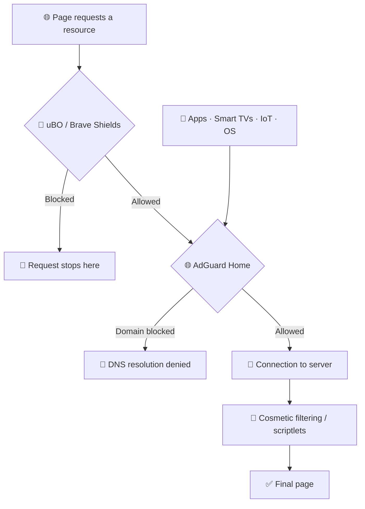

[🏠 Guide index](README.md) · Part 1 of 9

# 1. 🧱 Recommended Architecture

DNS filtering and browser-level filtering are **complementary layers, not alternatives**.

Each layer sees different information and therefore solves different problems.

## 🌐 AdGuard Home

AdGuard Home operates primarily at the **DNS/domain level**.

It is particularly useful for:

* applications without their own content blocker;
* smartphones and tablets;
* Smart TVs;
* game consoles;
* IoT devices;
* operating-system and application telemetry;
* advertising and tracking domains;
* known malicious, phishing, and scam domains.

However, DNS filtering cannot inspect the full URL or modify the page itself.

It cannot reliably distinguish between:

```text
example.com/ads/banner.js
```

and:

```text
example.com/article
```

because both requests ultimately resolve the same hostname:

```text
example.com
```

---

## 🧩 uBlock Origin and Brave Shields

Browser-level blockers have much more context.

They can evaluate:

* the full URL;
* the page that initiated the request;
* first-party vs. third-party requests;
* resource type;
* scripts;
* images;
* iframes;
* XHR/fetch requests;
* page elements.

They can also perform tasks that DNS filtering cannot, such as:

* cosmetic filtering;
* scriptlet injection;
* URL parameter removal;
* per-site exceptions;
* contextual network filtering.

---

## 🔄 Simplified request flow



> [!TIP]
> The browser performs the **fine-grained filtering**.
>
> AdGuard Home provides **broad network coverage** for traffic that never passes through a browser extension or built-in browser blocker.

This redundancy is useful.

Blindly duplicating millions of domain rules across every layer usually is not.

---

## 🔗 Related

* [2. ⚡ Quick Configuration](02-quick-configuration.md) — the concrete lists that implement this architecture.
* [5.5. 🚫 What Not to Put in AdGuard Home](05-adguard-home.md#55--what-not-to-put-in-adguard-home) — the practical consequence of the DNS/browser split.
* [4.7. Use One General-Purpose Browser Blocker](04-brave-shields.md#47-use-one-general-purpose-browser-blocker) — why the second layer should be DNS, not another extension.

---

🏠 [Index](README.md) · ➡️ Next: [2. ⚡ Quick Configuration](02-quick-configuration.md)
