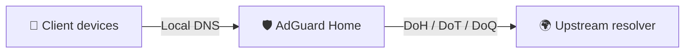

**[🏠 Guide index](README.md)** · Chapter 5 of 9

# 5. 🌐 AdGuard Home

AdGuard Home is where the **heavy domain-based filtering** should normally live.

Open:

<kbd>Filters</kbd> → <kbd>DNS blocklists</kbd>

---

## 5.1. 📙 HaGeZi Multi PRO++ — Full

Use **HaGeZi Multi PRO++** as the main DNS blocklist.

```text
https://cdn.jsdelivr.net/gh/hagezi/dns-blocklists@latest/adblock/pro.plus.txt
```

PRO++ applies a deliberately aggressive policy against categories such as:

* tracking;
* telemetry;
* affiliate infrastructure;
* analytics;
* advertising;
* other unwanted domains.

> [!CAUTION]
> **PRO++ is intentionally aggressive.**
>
> Be prepared to create narrow exceptions for legitimate services that are caught by the list.

---

## 5.2. ☣️ HaGeZi Threat Intelligence Feeds — TIF Full

Use **TIF Full**.

```text
https://cdn.jsdelivr.net/gh/hagezi/dns-blocklists@latest/adblock/tif.txt
```

TIF is primarily security-oriented and targets categories such as:

* malware;
* phishing;
* scams;
* spam;
* command-and-control infrastructure;
* other malicious domains.

> [!WARNING]
> **TIF Full is very large.**
>
> HaGeZi currently marks TIF Full for AdGuard Home systems with at least **2 GB of RAM**. Expect substantial memory use and longer filter reload times.

---

## 5.3. 🦠 Dandelion Sprout Anti-Malware

Use the AdGuard Home-specific version through **jsDelivr**:

```text
https://cdn.jsdelivr.net/gh/DandelionSprout/adfilt@master/Alternate%20versions%20Anti-Malware%20List/AntiMalwareAdGuardHome.txt
```

> [!IMPORTANT]
> Do not accidentally use the uBO-oriented version here.
>
> Each filtering engine should receive a list in a syntax it can interpret correctly.

---

## 5.4. 📦 Recommended AdGuard Home Profile

### ✅ Default profile

Use this profile first and keep it whenever the server handles it comfortably:

```text
AdGuard Home
├── HaGeZi Multi PRO++ — Full
├── HaGeZi TIF — Full
└── Dandelion Sprout Anti-Malware
```

```text
https://cdn.jsdelivr.net/gh/hagezi/dns-blocklists@latest/adblock/pro.plus.txt
https://cdn.jsdelivr.net/gh/hagezi/dns-blocklists@latest/adblock/tif.txt
```

### 🪶 Performance fallback

Only if the full lists create a real memory, reload-time, or stability problem, replace both HaGeZi lists with the single reduced profile below:

```text
AdGuard Home
├── HaGeZi Multi PRO++ — Mini
├── HaGeZi TIF — Medium
└── Dandelion Sprout Anti-Malware
```

```text
https://cdn.jsdelivr.net/gh/hagezi/dns-blocklists@latest/adblock/pro.plus.mini.txt
https://cdn.jsdelivr.net/gh/hagezi/dns-blocklists@latest/adblock/tif.medium.txt
```

> [!IMPORTANT]
> The fallback is not a co-equal recommendation. **PRO++ Full + TIF Full remains the default.** Use the reduced profile only after confirming that the full profile is causing performance problems.

---

## 5.5. 🚫 What Not to Put in AdGuard Home

Avoid indiscriminately importing lists designed primarily for browser content blockers.

A DNS filter cannot meaningfully apply browser-specific rules such as:

```text
||example.com/ads/banner.js
##.advertisement
$script
$removeparam
```

Those rules depend on information that DNS does not have.

A useful rule of thumb is:

> **DNS → domain-oriented filtering.**
> **Browser → URLs, request context, cosmetic filtering, scriptlets, and precise exceptions.**

---

## 5.6. 🔐 Encrypted Upstream DNS

AdGuard Home can use encrypted upstream resolvers via:

* **DoH** — DNS over HTTPS;
* **DoT** — DNS over TLS;
* **DoQ** — DNS over QUIC.

The architecture then looks like this:



This encrypts the DNS traffic between:

```text
AdGuard Home → upstream DNS resolver
```

It does not automatically encrypt ordinary DNS traffic between local clients and AdGuard Home.

For a trusted home LAN, unencrypted local DNS combined with an encrypted upstream is a perfectly reasonable design.

---

## 5.7. 🔏 DNSSEC

Check that DNSSEC validation has not been disabled in your installation.

There is no reason to toggle settings unnecessarily if your current configuration already has validation enabled and working correctly.

---

| ⬅️ Previous | 🏠 Index | Next ➡️ |
|:----------- |:--------:| ---------:|
| **[4. Brave Shields](04-brave-shields.md)** | **[All chapters](README.md)** | **[6. Preventing AdGuard Home Bypass](06-bypass-prevention.md)** |
