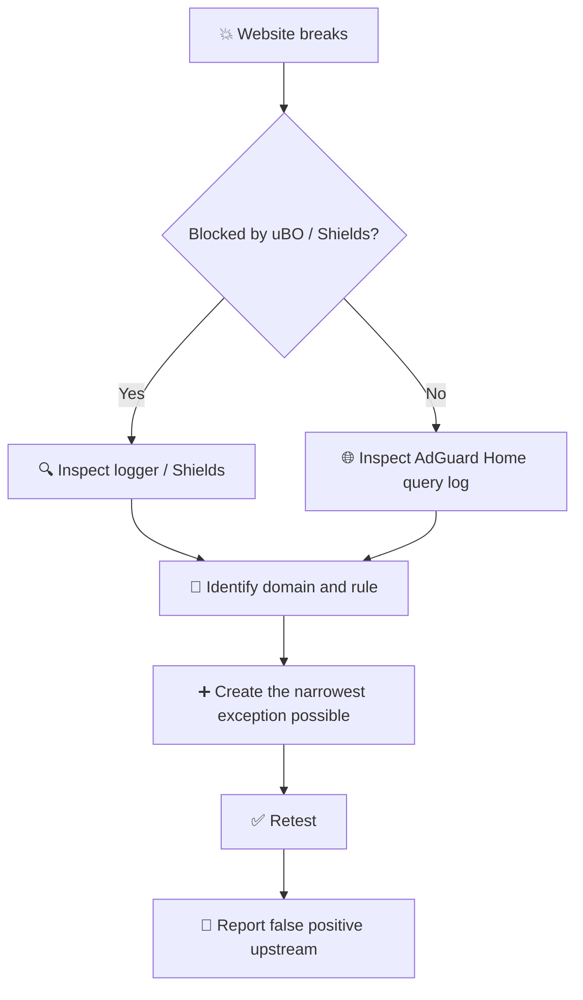

**[🏠 Guide index](README.md)** · Chapter 7 of 9

# 7. 🔍 Troubleshooting and False Positives

A strict configuration will eventually break something.

The difference between a maintainable setup and a frustrating one is **how you diagnose and repair those failures**.

> [!IMPORTANT]
> **Never disable an entire filter list to fix a single website unless you have determined that the list itself is unsuitable for your setup.**

---

## 🧭 Troubleshooting Flow



---

## 7.1. uBlock Origin

Open the **Logger** and reproduce the problem.

You want to identify:

```text
request
   ↓
matching rule
   ↓
responsible filter list
```

### Example of a Site-Specific Exception

```text
@@||api.example.com^$domain=www.affected-site.com
```

This allows `api.example.com` only when the request originates from:

```text
www.affected-site.com
```

That is generally preferable to allowing the domain globally.

---

## 7.2. AdGuard Home

Open:

<kbd>Query Log</kbd>

Reproduce the issue and inspect the blocked domain and matching rule.

A DNS exception might look like:

```text
@@||api.example.com^
```

> [!NOTE]
> A DNS exception is inherently broader than a contextual browser exception.
>
> AdGuard Home does not know which webpage caused the DNS lookup.

---

## 7.3. Brave Shields

Temporarily disable Shields **for the affected site only**.

If the page starts working:

1. identify which filtering category is responsible;
2. create or apply the narrowest reasonable exception;
3. restore the rest of Shields.

Avoid globally weakening Shields because one website is broken.

---

## 🕵️ Common Sources of False Positives

Typical offenders include:

* 💳 payment processors;
* 🏦 anti-fraud systems;
* 🔑 federated login providers;
* 🛍️ affiliate and cashback redirectors;
* 📶 captive Wi-Fi portals;
* 🏠 local services;
* 📊 analytics endpoints that are also used as functional dependencies.

---

| ⬅️ Previous | 🏠 Index | Next ➡️ |
|:----------- |:--------:| ---------:|
| **[6. Preventing AdGuard Home Bypass](06-bypass-prevention.md)** | **[All chapters](README.md)** | **[8. Verification](08-verification.md)** |
